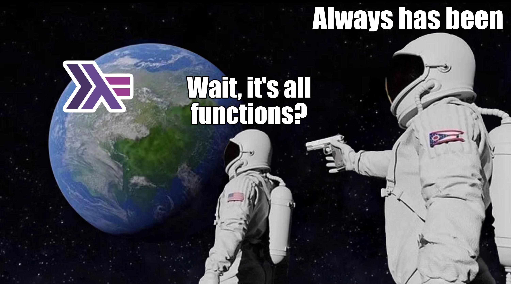

# Advent of Code 2023
This repo holds my solutions for the Advent of Code 2023 challenge. Pls don't be amazed with my *incredible, high level* (Haskell)[https://www.haskell.org] skills. I'm taking the oportunity to learn a bit of this language.

